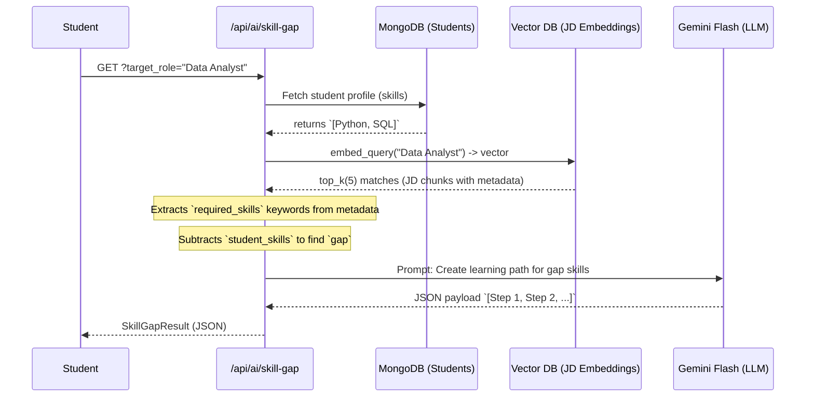

# AI Pipeline & RAG System

PlacementPro utilizes AI across two primary features:
1. **Skill Gap Analysis** (RAG based on Market Researched Job Descriptions)
2. **PlacementBot** (A LangChain tool-calling Agent)

Both are reliant on **Google Gemini Flash 2.5/2.0** models and **Pinecone**.

---

## 1. Skill Gap Analysis (RAG)

The skill gap analyzer retrieves vectors from Pinecone related to a student's desired `target_role` (e.g., Data Analyst, SDE). 
These vectors represent chunks of real market job descriptions.

### Pipeline Flow



**Key Code Files**:
- `services/ai/skill_gap.py`
- `scripts/ingest_job_descriptions.py`

---

## 2. PlacementBot (Agent)

The PlacementBot helps all users query information dynamically. It is configured with `langchain.agents.create_tool_calling_agent`.

### Tools
- `get_drive_info(company_name)` -> MongoDB `company_drives` search.
- `get_cutoff(company_name)` -> Queries criteria matching.
- `get_interview_schedule(company_name)` -> Fetch day/time for drive from `interviews`.
- `get_faqs(topic)` -> Static fallback text rules.

### Interaction Flow

```mermaid
flowchart TD
    User([User Chat Message]) --> POST_API[POST /api/ai/chat]
    POST_API --> CheckCache[Check Rate Limits (20/min)]
    CheckCache --> Bot[AgentExecutor (Gemini Flash)]
    
    Bot --> Tool1{Action: Tool Call}
    
    Tool1 -- "get_drive_info" --> DB1[(MongoDB)]
    Tool1 -- "get_faqs" --> ST[(Static YAML)]
    
    DB1 -.-> |Results "TCS"| Bot
    ST -.-> |Answers "Timings"| Bot
    
    Bot --> Reply([Reply formatting])
    Reply --> User
```

**Key Code Files**:
- `services/ai/placement_bot.py`
- `routers/ai.py`
