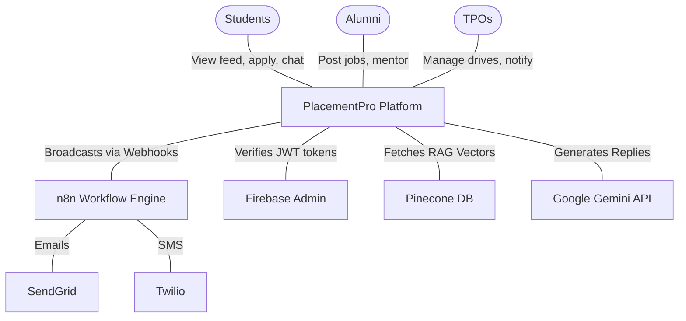
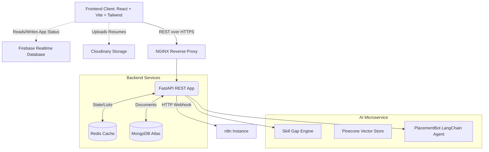
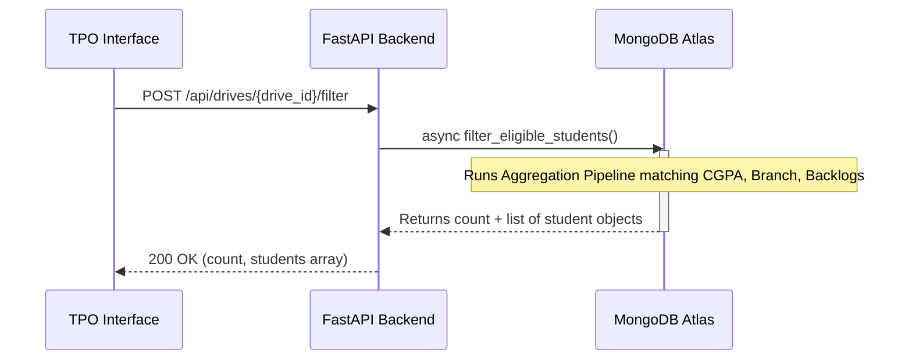

# PlacementPro Component Architecture (C4 Model)

## Context Diagram

```mermaid
graph TD
    S([Students]) --- |View feed, apply, chat| PP[PlacementPro Platform]
    A([Alumni]) --- |Post jobs, mentor| PP
    T([TPOs]) --- |Manage drives, notify| PP
    PP --- |Broadcasts via Webhooks| N[n8n Workflow Engine]
    N --- |Emails| SG[SendGrid]
    N --- |SMS| TW[Twilio]
    PP --- |Verifies JWT tokens| FA[Firebase Admin]
    PP --- |Fetches RAG Vectors| P[Pinecone DB]
    PP --- |Generates Replies| G[Google Gemini API]
```

## Container (System) Diagram

```mermaid
graph TD
    UI[Frontend Client: React + Vite + Tailwind]
    UI -.-> |Reads/Writes App Status| FD[Firebase Realtime Database]
    UI -.-> |Uploads Resumes| FS[Cloudinary Storage]
    
    UI -->|REST over HTTPS| Nginx[NGINX Reverse Proxy]
    
    subgraph backend [Backend Services]
        FastAPI(FastAPI REST App)
        Redis[(Redis Cache)]
        Mongo[(MongoDB Atlas)]
    end
    
    Nginx --> FastAPI
    
    FastAPI <-->|State/Lists| Redis
    FastAPI <-->|Documents| Mongo
    
    FastAPI -->|HTTP Webhook| n8n[n8n Instance]
    
    subgraph ai [AI Microservice]
        SkillGap[Skill Gap Engine]
        PineconeAuth[Pinecone Vector Store]
        Agent[PlacementBot LangChain Agent]
    end
    
    FastAPI --> SkillGap
    FastAPI --> Agent
```

## Sequence: Placement Drive filtering

```mermaid
sequenceDiagram
    participant TPO as TPO Interface
    participant BE as FastAPI Backend
    participant DB as MongoDB Atlas

    TPO->>BE: POST /api/drives/{drive_id}/filter
    BE->>DB: async filter_eligible_students()
    activate DB
    Note over DB: Runs Aggregation Pipeline matching CGPA, Branch, Backlogs
    DB-->>BE: Returns count + list of student objects
    deactivate DB
    BE-->>TPO: 200 OK (count, students array)
```
