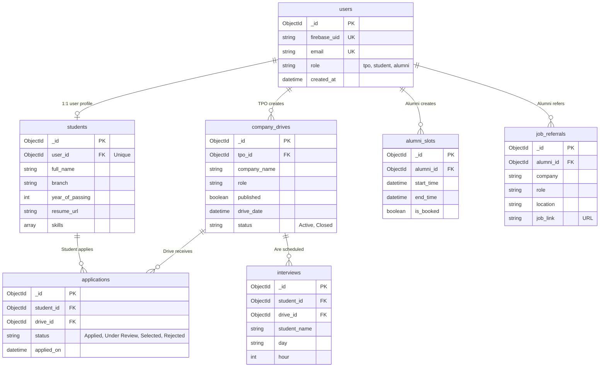

# MongoDB Schema (ERD)

## Schema Overview

The central database used for PlacementPro is a NoSQL MongoDB Atlas cluster. Documents are heavily schema-enforced at the application level using `Pydantic` and `bleach` to ensure types, sanity, and anti-XSS protection.

## Indexes

| Collection | Indexed Fields | Options |
| --- | --- | --- |
| `users` | `firebase_uid` | Unique |
| `users` | `email` | Unique |
| `students` | `user_id` | Unique |
| `applications` | `(student_id, drive_id)` | Compound Unique |
| `applications` | `status` | Single |
| `alumni_slots` | `alumni_id` | Single |
| `alumni_slots` | `is_booked`, `start_time` | Compound Sorting |
| `company_drives` | `status` | Single |
| `job_referrals` | `alumni_id` | Single |
